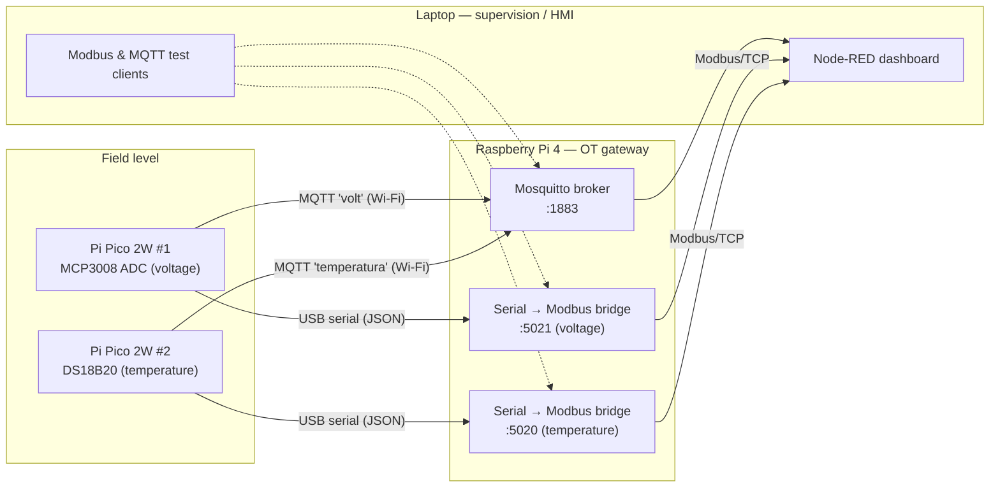

# Industry 4.0 IT/OT Lab — MQTT + Modbus/TCP

Code and configuration for the prototype built in my Bachelor's thesis (*Trabajo de Fin de Grado*):
a small IT/OT lab where field sensors publish over **MQTT** and are also exposed to a SCADA-style
supervisor over **Modbus/TCP**, through a Raspberry Pi acting as the OT gateway.

The goal is to make the whole environment reviewable and reproducible.

## Architecture

| Component | Role | Interface |
|---|---|---|
| Pi Pico 2W #1 | Reads an analog channel through an MCP3008 ADC | MQTT topic `volt`, USB serial |
| Pi Pico 2W #2 | Reads a DS18B20 temperature probe | MQTT topic `temperatura`, USB serial |
| Raspberry Pi 4 | Mosquitto broker + two serial-to-Modbus bridges (pymodbus) | `1883/tcp`, `5020/tcp`, `5021/tcp` |
| Laptop | Node-RED HMI and command-line test clients | — |

**Modbus register map** (unit ID `1`, on both bridges):

| Port | Register | Value |
|---|---|---|
| `5020` | IR0 / HR0 | Temperature × 10 (tenths of °C, 16-bit) |
| `5021` | IR0 / HR0 | Raw ADC reading of channel 0 |

## Repository layout

- `Pi_Pico/`: MicroPython firmware for the two Pico 2W boards (sensor reading, MQTT publishing, serial output).
- `Raspberry_Pi4/`: OT gateway (Mosquitto configuration and the serial-to-Modbus/TCP bridges).
- `Laptop_Scada/`: supervision side (Node-RED flow plus Modbus and MQTT test clients).
- `project_planning/`: project plan.

## Security notes

The lab was built as a realistic small-scale OT setup, so it reflects the weaknesses common in
real plants. They are documented here:

| Area | Observation | Mitigation in a production setup |
|---|---|---|
| MQTT transport | Plain-text MQTT on `1883`; credentials and readings travel unencrypted over Wi-Fi | TLS listener on `8883`, client certificates |
| MQTT authorization | Per-sensor users exist, but no per-topic ACLs, so any authenticated client can publish to any topic. A dedicated topic (`tf/sensor/analog`) was used to test message injection | ACLs restricting each sensor to its own topic |
| Modbus/TCP | No authentication or encryption, which is inherent to the protocol. Bridges listen on `0.0.0.0` and expose writable holding registers | Network segmentation (zones and conduits, IEC 62443), firewall allowlist for the SCADA host, read-only register map |
| Flat network | Field devices, gateway and HMI share a single network segment | Separate OT VLAN, DMZ between IT and OT |
| Device credentials | Wi-Fi and MQTT credentials live in a git-ignored `config.py` on each board (see `config.example.py`) | Per-device secrets, provisioning, regular rotation |

## Reproducing the lab

The full step-by-step setup is described in the thesis document and its annexes, which are not
included here to keep the repository light. As a quick reference:

1. Install Mosquitto on the Raspberry Pi with the configuration in `Raspberry_Pi4/mosquitto/`.
2. On each Pico, copy `config.example.py` to `config.py`, fill in your values, and flash `main.py` with its libraries.
3. Install `Raspberry_Pi4/modbus_bridge/requirements.txt` in a virtualenv and start both bridges.
4. Import `Laptop_Scada/Node_Red/flows.json` into Node-RED and update the IP addresses for your network.

## License

This repository is part of a Bachelor's thesis and is published under the
**Creative Commons Attribution-NonCommercial-NoDerivatives 3.0 Spain** license (see `LICENSE.txt`).
